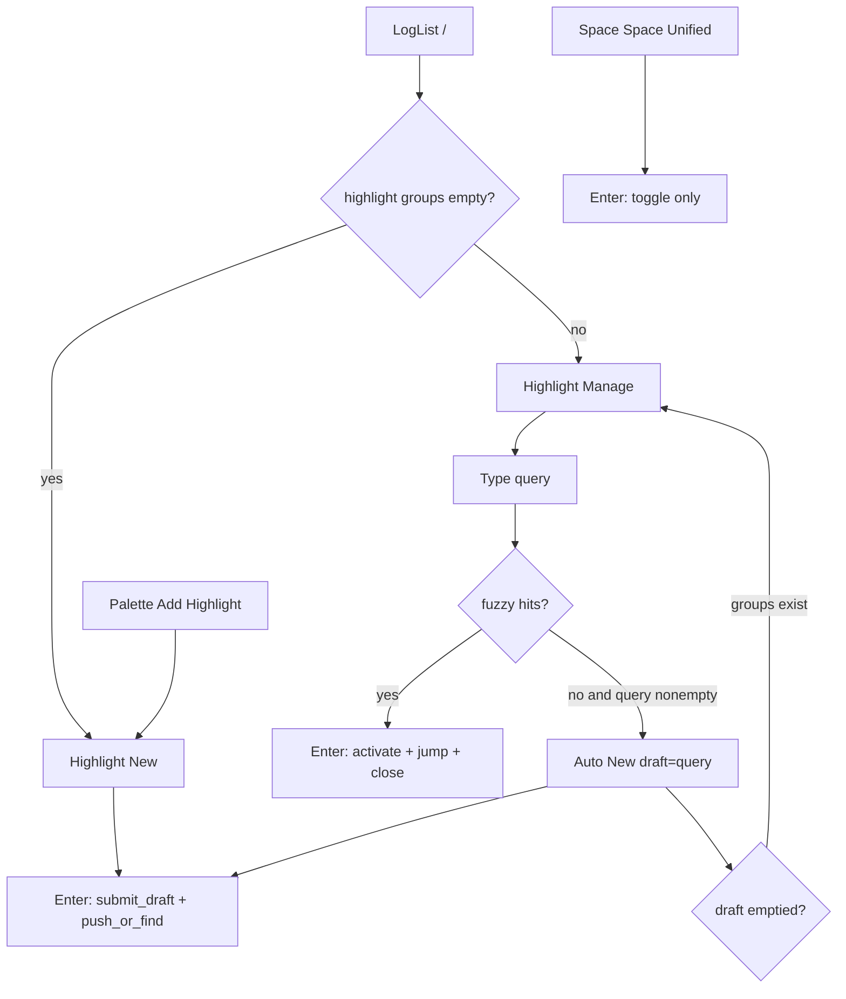

# Design: Highlight find-or-create picker

## Architecture

`/` stays `ActionId::GlobalHighlightNew` (keymap-stable). Its dispatch becomes find-or-create. Palette **Add Highlight** must remain force New, so it becomes a new palette-only `ActionId::GlobalHighlightAdd`.

`PickerKind::Highlight` Manage becomes a **per-kind** panel (same convention as Bookmark/Preset): branch in both `picker_render_data` and `handle_picker_key`. Do not reuse `unified_picker_items` (that list is Filter+Highlight+Exclude).

```
LogList `/`  → App::open_highlight_finder()
                 empty groups → open_picker_new(Highlight)
                 else         → open_picker(Highlight)   # Manage

Palette Add  → open_picker_new(Highlight)

Highlight Manage Enter → App::activate_highlight_group(idx)
                           enable if needed
                           active_highlight = idx
                           restart file highlight scan if needed
                           jump_first_match_of(idx)
                           close_picker()

Highlight Manage query, 0 hits → enter_new(); draft = query
Highlight auto-New, draft empty, groups remain → back to Manage
```



## Action / keymap

| ActionId | Default key | Palette | Dispatch |
|----------|-------------|---------|----------|
| `GlobalHighlightNew` | `/` | **Find Highlight** (keep in `PALETTE_IDS`, retitle) | `open_highlight_finder()` |
| `GlobalHighlightAdd` | unbound | **Add Highlight** (replace the old title on New) | `open_picker_new(Highlight)` |

- `toml_key` for the new id: `highlight_add`. `--init` must serialize it.
- Help / status L2: `/` detail = find-or-create, not “open highlight picker in new mode”.
- Do not rebind Help `/`.

## Picker contracts

### Highlight Manage (new kind branch)

- Candidates: `highlight_groups.groups[i].pattern` in storage order.
- Filter: `PickerSession::filtered_indices`.
- Row action icon: `ActionKind::Jump` (activate/view), not Toggle.
- Preview: existing `preview_highlight_pattern_lines` for the selected pattern.
- Keys: Up/Down, type into `query`, Enter = activate selected, Ctrl-X = Edit, Delete/Ctrl-Backspace = delete confirm (`DeleteMany` with one Highlight `UnifiedId`, or a small Highlight-only confirm — prefer reuse `DeleteMany` with a single id).
- No Tab multi-select (Bookmark convention).
- Empty query + empty groups should not appear: opener already sent those sessions to New.

### Auto New / back

- Trigger only for `PickerKind::Highlight` + `PickerMode::Manage` + nonempty query + zero filtered indices (on query edit, not on open).
- Copy `query` → `draft`, then `enter_new()` **without** wiping the draft (today `enter_new` clears draft — add `enter_new_with_draft` or set draft after).
- Flag `session.auto_from_manage: bool` (or equivalent) so clearing draft returns to Manage only for this path.
- Clearing draft: `mode = Manage`, `query.clear()`, `selected = 0`, `auto_from_manage = false`.
- Palette / empty-list New: `auto_from_manage` false; empty Backspace stays in New.

### Highlight New

- Empty draft: no history candidate list; empty_msg stays `type a pattern`.
- Non-empty draft: vocab list + Tab last-token replace (unchanged).
- Enter: `submit_draft` only. Then `push_or_find_highlight_group` (exact ignore-case) + `jump_first_match_of` + close. Stop using `confirm_or_submit` on the New path so fuzzy history cannot steal the draft.
- Edit mode still updates the indexed group (`update_search_group`) and refuses exact duplicates with `EXISTS`.

## App helpers

```text
App::open_highlight_finder()
  if highlight_groups.groups.is_empty() { open_picker_new(Highlight) }
  else { open_picker(Highlight) }

App::activate_highlight_group(index) -> bool
  enable group if disabled
  active_highlight = Some(index)
  match_stats_stale = true
  file: restart_highlight_scan()
  jump_first_match_of(index)
```

Enable-before-jump is mandatory: `jump_first_match_of` returns false when `!enabled`.

## Help

Update `page_doc_lines` Highlight + Picker and any HintEntry detail that says `/` force New. Status-help spec is Phase 3.3, not this change set’s product code.

## Compatibility

- User `keymap.toml` `highlight_new = "/"` keeps working; behavior of that action changes (find-or-create).
- New `highlight_add` has no default binding; existing configs ignore the unknown key until `--init` refresh.
- Unified Manage, Filter/Exclude New, `fh`, paint ramp: no contract change.

## Trade-offs

| Choice | Why |
|--------|-----|
| Per-kind Highlight Manage vs special-casing Unified | Spec already forbids stuffing new Manage panels into `unified_picker_items`. |
| Split Add vs Find ActionIds | Palette title “Add Highlight” must stay force New; `/` cannot. |
| Auto-New only on Highlight finder | Unified already tested as stay-in-Manage; do not revive that. |
| Keep other paints | Product: overlay is a feature; solo/`fh` are explicit other verbs. |

## Rollback

Revert the ActionId split, restore `open_picker_new` on `/`, restore New `confirm_or_submit` history list. No data format change.
