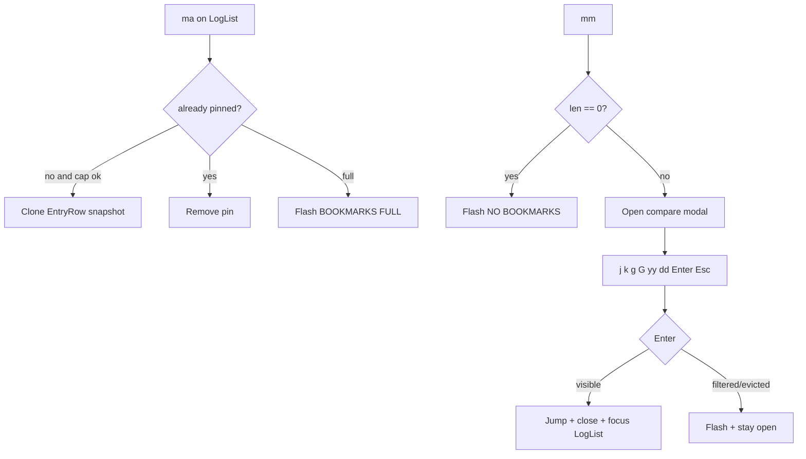

# Design: Bookmark compare tray

## Architecture

Pins become **owned snapshots** plus a **jump id**. The compare UI is a new modal (`App.compare`), not `PickerKind::Bookmark`.

```
LogList ma  → copy current RowRef into Bookmark.row (EntryRow clone)
              row_id → bookmark_row_ids
LogList md  → remove by current row_id
mm          → empty? flash NO BOOKMARKS
            → else open ComparePanel { cursor, list_offset, pending_d, pending_y }
               following = false

Compare panel render
  sorted_indices(bookmarks)  // time_full then row_id; untimed last
  for each pin: prefix (☆? + Δt) + render_entry_lines(snapshot, no lineno)
  always wrap (ignore collapsed_view)

Enter → jump_to_bookmark(row_id) then close on Ok
dd    → delete storage index of selected display row; sync HashSet; 0 → close
yy    → apply_yank(snapshot.raw)
Esc/C-c → close, no resume_following
```



## Data model

### `Bookmark`

Replace `label: String` as the display source with an owned `EntryRow` (or an equivalent owned struct with the same fields). Keep `row_id` duplicated or use `row.row_id` only — `bookmark_row_ids` still keys on that id.

Do **not** reintroduce `enabled`.

`bookmark_label` may remain as a helper for tests/summary fallback; the panel must not depend on a truncated label string.

### `BookmarkList`

- `BOOKMARK_SOFT_CAP = 16`.
- Remove `BOOKMARK_DISPLAY_N` / `display_recent` (newest-3).
- Add display helpers (names indicative):
  - `sorted_indices(&self) -> Vec<usize>` — storage indices in compare order.
  - `summary_line(&self) -> String` — `★ N` + optional span.
  - `delta_label(prev_ts, curr_ts) -> Option<String>` — `None` = hide Δt (first timed); `Some("—")` untimed; `Some("+1.2s")` timed.
- `try_add` stays insert-if-absent; toggle lives on `App::bookmark_add_current` (add or `remove_id`).

### Sort / Δt / span

Reuse `LogEntry::time_full` / `time_hms` via `snapshot.as_log_entry()`:

| Stamp | Sort | Summary span |
|-------|------|----------------|
| xlog `YYYY-MM-DD HH:MM:SS…` | `time_full` lex, then `row_id` | Same calendar day → HMS only; else include date |
| threadtime `MM-DD HH:MM:SS…` | same | Same `MM-DD` → HMS; else `MM-DD HH:MM:SS→…` |
| empty / brief | after timed, by `row_id` | ignored in span |

Δt: difference of parsed HMS (plus date when both have dates). After sort, Δt vs previous **timed** neighbor is ≥ 0 in normal same-format logs. Mixed formats in one tray are YAGNI; still must not panic.

### `ComparePanel`

```rust
pub struct ComparePanel {
    pub cursor: usize,       // index into sorted_indices()
    pub list_offset: usize,
    pub pending_d: bool,
    pub pending_y: bool,
}
```

`App.compare: Option<ComparePanel>`. Opening clamps `cursor` to `0`. After `dd`, clamp cursor. This is **not** `Focus` and **not** a `PickerSession`.

Pending `d`/`y` on the panel must not leak into strip `pending_d` or LogList `pending_yank` after close (clear on close/cancel).

## Rendering

### Summary (log top)

`render_log_list`: if `!bookmarks.is_empty()`, paint **one** row with `theme::bookmark_strip_style` + `bookmark_label_style` (or a dedicated summary token). Height 1. Then the list fills the rest. No wrap of pin bodies here.

### Compare modal

- Chrome: `render_modal_shell` / rounded popup (quality: popup ≠ strip divider). Large: most of the frame (similar to Help), not half-width picker without preview.
- Build `List`/`Paragraph` of `ListItem`s from `render_entry_lines` on each snapshot. Shrink inner width by prefix cells; prefix only on the first wrapped line of that pin (`☆ +1.2s ` or `    +1.2s ` / `☆ — `).
- Selection: `theme::log_selection_style()` on the selected **pin** (panel is the focused surface). Do not use picker candidate tokens.
- `☆` uses `theme::bookmark_stale_style()`. Δt uses a new muted token, e.g. `theme::compare_delta_style()`.
- Jumpable = `visible_idx_for_row_id(id).is_some()`. Alive-but-filtered and evicted both get `☆`.
- Ignore `collapsed_view`. Apply current highlight/search patterns the same way as the main log.

## Key dispatch

Handle **before** LogList/picker, while `app.compare.is_some()` (same layering as Help):

| Key | Action |
|-----|--------|
| `j` / Down | cursor +1, clamp |
| `k` / Up | cursor −1 |
| `g` | cursor = 0 |
| `G` | cursor = last (not resume following) |
| `y` | if `pending_y` { yank raw; clear } else set `pending_y` |
| `d` | if `pending_d` { delete; clear } else set `pending_d` |
| other after pending | clear pending; ignore (no leak to LogList) |
| Enter | jump / flash |
| Esc / Ctrl+C | close |

Unbound keys do not fall through to LogList (modal swallow). `?` Help: either unavailable while compare is open (like command palette) **or** opens Help on top — prefer **unavailable** (`help_available` false) so we do not nest modals. Document in Help as LogList/`pending_m` keys only.

`ActionId::BookmarkManage` dispatch: `open_compare_panel()` instead of `open_picker(Bookmark)`.

## Picker cleanup

`mm` must not construct `PickerKind::Bookmark`. Remove Bookmark Manage render/key arms, `bookmark_visible_indices`, `ConfirmKind::DeleteBookmark`, and tests that encode newest-first fzf. If `PickerKind::Bookmark` has no remaining callers, delete the variant; otherwise leave a compile-fail unused arm.

Do not route the compare list through `UnifiedKind`.

## Help / status / palette

- `BookmarkManage` meta: label/detail/palette = open compare panel (English). `--init` keymap dump follows `ActionMeta`.
- `pending_m` L2: add / delete / open panel (not “manage”).
- New `ContextKind` when `compare.is_some()`: `j`/`k`, `g`/`G`, `yy`, `dd`, Enter, Esc.
- Flash strings stay English (`NO BOOKMARKS`, `BOOKMARKS FULL`, `BOOKMARKED`, `REMOVED`, `YANKED` / `YANK FAILED`, existing jump flashes).

## Testing

Prefer App/unit tests over full TUI snapshots:

- Toggle `ma`, cap 16, untimed sort last, Δt vs previous timed, summary same-day vs cross-day.
- `open_compare_panel` none vs some; Enter Ok/Filtered/Evicted; `dd` last closes; `yy` sets `last_yanked` to raw (clipboard may fail in CI — assert `record_yank` / `last_yanked` like existing yank tests).
- `mm` does not set `app.picker` to Bookmark.
- Rewrite Help tests that still say “bookmark manage”.

## Compatibility

- No on-disk format. Session-only.
- File and live both snapshot via `current_row()` clone. File `row_id = line_index+1` unchanged for jump.
- `clear_bookmarks` / source switch still wipe pins (existing).
